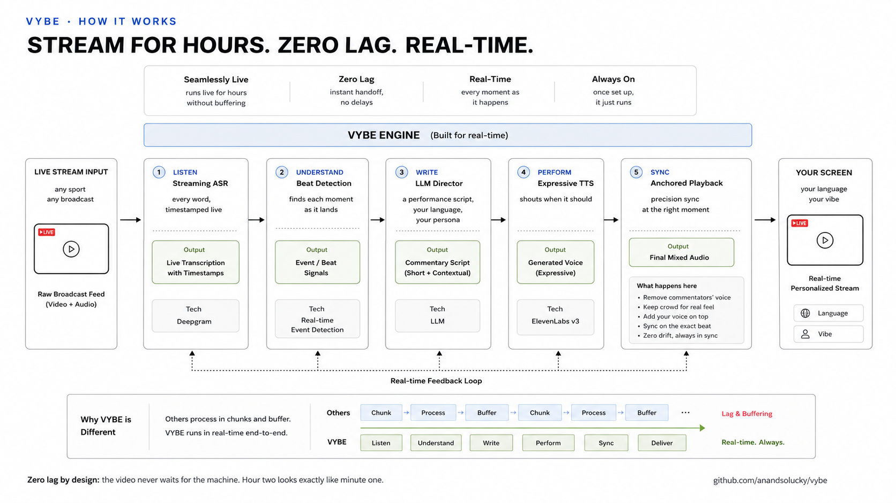

# VYBE

**Same game. Your vibe.**

VYBE is the personalized live-sports experience: watch any live match in
your language, with your energy, called by the voice you choose. Not a
translation — a different way to experience the same game.

Under the hood: VYBE captures the stream, delays it 15 seconds, and
replaces the commentary with an AI persona — synced to the action, with
real emotion. The original commentator is gone. The crowd stays. You can
switch VYBES and languages mid-match.

Once the match starts there is no lag, no stutter, no buffering: the
video never waits for the AI. A line that cannot make its slot is
dropped, never delayed — playback stays glass-smooth by design.

> Every "live" stream is already 15–40 seconds behind the stadium.
> VYBE does all of its work inside that gap.

## What it does

- **Pick a sport.** Cricket and football ship. A sport is a director
  preset — vocabulary, outcome calls, where the excitement peaks — not a
  codepath.
- **Pick a VYBE.** Three Hindi personas ship today: Jatin (the pro),
  Kabir (the Gen Z), Naina (the Bombay vibe). Each has a voice, a
  register, and its own way of calling a six.
- **Pick a language.** Hindi, Gujarati, Tamil, Marathi, Japanese,
  Spanish, Portuguese and French ship today — switchable live during
  the match. A language is a prompt override plus a multilingual voice,
  so adding one is configuration, not code.
- **Keep the stadium.** Center-cancel source separation removes the
  broadcast voice and keeps the crowd. Mono sources fall back to
  sidechain ducking.
- **Go parallel (demo mode).** An opt-in checkbox renders every VYBE on
  every beat so switching commentators is instant. Roughly 3× the TTS
  cost — the default stays one lane with a short warm-up on switch.
- **Stay honest.** A hard timing law: the AI never speaks before the
  source commentator reacts. Late lines get dropped. The video never
  waits.

## How it works



```
Chrome tab ──► PCM ingest ──► streaming ASR ──► beat segmentation
 (capture)      (WebSocket)    (word timestamps)       │
                                                       ▼
 delayed video ◄── anchored ◄── expressive TTS ◄── LLM "director"
 (MediaSource,     scheduler     (emotion tags)    (persona script)
  15s buffer)
```

1. The browser captures a Chrome tab (video + audio) and buffers the
   video 15 seconds with MediaSource.
2. Tab audio streams to Deepgram (Nova-3) for word-level timestamps.
3. Beat segmentation finds the source commentator's reactions.
4. An LLM "director" writes what the chosen persona says for each beat —
   a performance script with inline emotion tags (`[shouts, ecstatic]`,
   stretched words like "Goooone!"), not a translation.
5. ElevenLabs (eleven_v3) performs the script.
6. Each line is anchored to its source reaction and scheduled against
   the delayed video. Never early; drop rather than delay.

The full decision log lives in [docs/DECISIONS.md](docs/DECISIONS.md) —
16 ADRs covering the timing law, the audio bed, persona design, and cost
control. [docs/tts-writing-guide.md](docs/tts-writing-guide.md) covers
how to write text that a TTS voice can actually perform.

## Run it

Requirements: Python 3.11+, ffmpeg, Chrome. Developed on macOS.

```bash
git clone <this repo> && cd vybe
python3 -m venv .venv && .venv/bin/pip install -r requirements.txt
cp .env.example .env    # fill in Deepgram, ElevenLabs, and LLM keys
.venv/bin/python -m vybe.cli check       # verify the environment
PYTHONPATH=src .venv/bin/python -m vybe.cli play --tab
```

Open `http://127.0.0.1:8791`, choose a language and a VYBE, share the
Chrome tab playing the match (tick "Also share tab audio"), and watch.

Other commands: `direct` (transcript → segments), `render` (offline
file pipeline), `play --replay` (re-run saved segments without TTS
cost), `devices` (list capture devices).

## Providers

Everything speaks through small adapters — swap any layer via `.env`
and `config.yaml`:

| Layer | Default | Notes |
|---|---|---|
| ASR | Deepgram Nova-3 | streaming, word timestamps |
| LLM | any OpenAI-compatible endpoint | small models work; it writes short lines |
| TTS | ElevenLabs eleven_v3 | inline emotion tags; Creator plan for library voices |

Running cost is roughly **$0.05 per minute** of TTS at measured usage
(~500 characters/min at $0.10/1K), plus pennies for ASR and the LLM.

## What was hard

The AI was the easy 20%. The other 80%:

- Browser media internals — MediaSource quota eviction, timeline holes,
  PCM clock vs recorder clock drift.
- The never-early guarantee under real latency jitter.
- Making a voice *perform* instead of read — the delivery layer that
  turns "six" into "SIIIIX!" at the right moment and never anywhere else.
- ASR mangling names mid-match ("Kohli" → "golly") — fixed with a
  deterministic name-repair map.

## Beyond cricket

Cricket is the demo, not the boundary. The pipeline never looks at the
picture — it listens to the source audio, understands the moments, and
performs a new track against a delayed buffer. That pattern applies to
any live feed where the words matter and the timing is unforgiving:
another sport, a keynote, a news desk, a live auction. Football is
already a second preset; adding a third is a prompt block, not a fork.

## Personas

Personas live in `avatars/<lang>/<id>.yaml`: voice config, speaking
rate, register, slang budget, and an approved sample line. Add a
persona by adding a file. The brand rules for anything user-facing are
in [brand.md](brand.md).

## License

[MIT](LICENSE) — © 2026 Anand Solanki. Built with passion.

Bundled third-party work — hls.js (Apache-2.0), Inter and Space Grotesk
fonts (SIL OFL 1.1) — is listed in
[THIRD_PARTY_LICENSES.md](THIRD_PARTY_LICENSES.md).

**A note on use:** VYBE personalizes your own, private viewing of a
stream you already have access to. Nothing is recorded, stored, or
redistributed. You are responsible for complying with the terms of the
services you watch.
